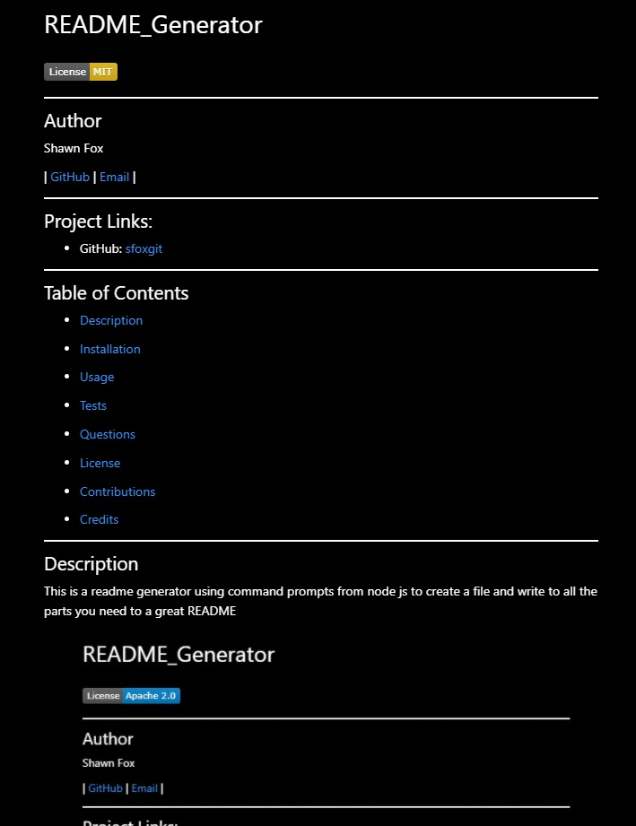
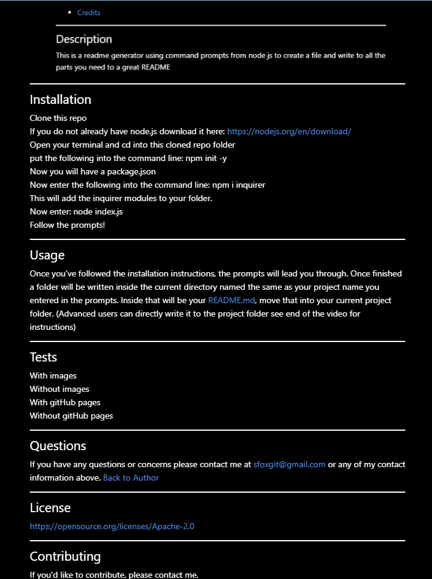

# README_Generator

  
  
  ---
  ## Author
  
  Shawn Fox
  
  
  | [GitHub](https://github.com/sfoxgit) | [Email](sfoxgit@gmail.com) |
  
  ---
  ## Project Links:
  
  - Instructional Video: [Part1](https://drive.google.com/file/d/1fj0_4FZxQqtxBiJlshtnN5XEoDJXzYau/view)

  - Instructional Video: [Part2](https://drive.google.com/file/d/1KaPob059dWu0_1fqQDiMpzvEy6IBG1yj/view)
  
  - GitHub: [sfoxgit](https://github.com/sfoxgit/README_Generator)
  
  ---
  ## Table of Contents
  
  - [Description](##Description)
  
  - [Installation](##Installation)
  
  - [Usage](##Usage)
  
  - [Tests](##Tests)
  
  - [Questions](##Questions)
  
  - [License](##License)
  
  - [Contributions](##Contributing)
  
  - [Credits](##Credits)
  
  ---
  ## Description
  
  This is a readme generator using command prompts from node js to create a file and write all the parts you need to have a great README
  
 
  
 
 
 
  
 
 
  
  ---
  ## Installation
  
  Clone this repo   If you do not already have node.js download it here: https://nodejs.org/en/download/   Open your terminal and cd into this cloned repo folder   cd into the assets folder   Now enter the following into the command line: npm i inquirer   This will add the inquirer modules to your folder.   cd .. out of assets and back into the root folder   Now enter: node index.js   Follow the prompts!

  - Instructional Video: [Part1](https://drive.google.com/file/d/1fj0_4FZxQqtxBiJlshtnN5XEoDJXzYau/view)

  - Instructional Video: [Part2](https://drive.google.com/file/d/1KaPob059dWu0_1fqQDiMpzvEy6IBG1yj/view)
  
  ---
  ## Usage
  
  Once you've followed the installation instructions, the prompts will lead you through. Once finished a folder will be written inside the current directory named the same as your project name you entered in the prompts. Inside that will be your README.md, move that into your current project folder. (Advanced users can directly write it to the project folder see end of the video for instructions)
  
  ---
  ## Tests
  
  With images   Without images   With gitHub pages   Without gitHub pages  
  
  ---
  ## Questions
  
  If you have any questions or concerns please contact me at sfoxgit@gmail.com or any of my contact information above. [Back to Author](##Author)
  
  
  --- 
 
 ## License 
 
 https://opensource.org/licenses/MIT
  
  ---
  ## Contributing
  
  
  
  If you'd like to contribute, please contact me.
  
  ---
  ## Credits
  
  https://gist.github.com/lukas-h for the license badges
  
  Simon Boudrias (twitter: @vaxilart) - Inquirer

